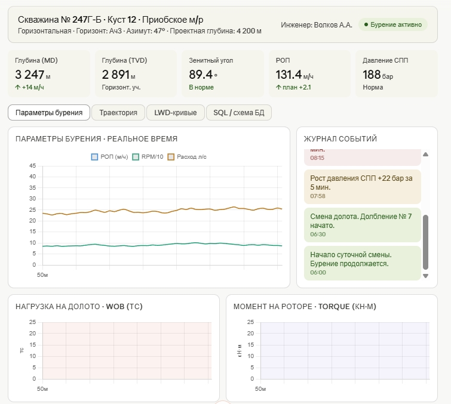

---  Drilling Monitoring Dashboard

**Дашборд мониторинга бурения** — учебный проект инженера MWD/LWD.  
Демонстрирует применение Python и SQL для анализа данных реального времени в нефтегазовой отрасли.


---

--- О проекте



Реализует систему мониторинга параметров бурения, аналогичную центрам ИТС нефтяных компаний.  
Данные синтетические, но структура, алгоритмы и SQL-схема соответствуют реальным промысловым системам.

**Стек:** Python · PostgreSQL · Pandas · Matplotlib · Jupyter Notebook

---

--- Возможности

| Модуль | Описание |
|--------|----------|
| `inclinometry.py` | Расчёт траектории скважины методом минимальной кривизны (TVD, Север, Восток, DLS) |
| `lwd_analysis.py` | Анализ LWD-кривых (ГК, УЭС), автоматическая литологическая разбивка |
| `npt_report.py` | Расчёт и визуализация НПВ по интервалам бурения |
| `generate_data.py` | Генерация синтетических данных (WITS-формат) |
| `sql/schema.sql` | Схема БД PostgreSQL: скважины, инклинометрия, параметры бурения, LWD |
| `sql/analytics_queries.sql` | SQL-запросы: НПВ-анализ, аномалии давления, литология по ГК |
| `dashboard/index.html` | Интерактивный дашборд: траектория, LWD-кривые, параметры бурения |

---

--- Быстрый старт

```bash
git clone https://github.com/YOUR_USERNAME/drilling-monitoring-dashboard.git
cd drilling-monitoring-dashboard
pip install -r requirements.txt

python python/generate_data.py    # сгенерировать данные
python python/inclinometry.py     # рассчитать траекторию
python python/npt_report.py       # отчёт по НПВ
```

Дашборд: открыть `dashboard/index.html` в браузере (без сервера).

---

--- Ключевые алгоритмы

--- Метод минимальной кривизны (Minimum Curvature)

Стандартный промышленный метод расчёта траектории горизонтальных скважин.

```python
import numpy as np

def minimum_curvature(md1, md2, inc1, inc2, az1, az2):
    dm = md2 - md1
    i1, i2 = np.radians(inc1), np.radians(inc2)
    a1, a2 = np.radians(az1),  np.radians(az2)
    dl = np.arccos(np.cos(i2-i1) - np.sin(i1)*np.sin(i2)*(1-np.cos(a2-a1)))
    rf = (2/dl)*np.tan(dl/2) if dl > 1e-6 else 1.0
    dTVD   = (dm/2)*(np.cos(i1)+np.cos(i2))*rf
    dNorth = (dm/2)*(np.sin(i1)*np.cos(a1)+np.sin(i2)*np.cos(a2))*rf
    dEast  = (dm/2)*(np.sin(i1)*np.sin(a1)+np.sin(i2)*np.sin(a2))*rf
    return dTVD, dNorth, dEast
```

--- Детекция аномалий давления (признак ГНВП)

```python
def detect_pressure_anomaly(df, threshold=20, window=5):
    df['spp_delta'] = df['spp'].diff(periods=window)
    return df[df['spp_delta'] > threshold][['ts_utc','md','spp','spp_delta']]
```

---

--- Структура базы данных

```
wells ──────────────┬── inclinometry    (md, inc, az, tvd, north, east, dls)
                    ├── drilling_params  (ts, md, rop, wob, rpm, torque, spp)
                    └── lwd_curves      (md, gr, res_deep, res_med, res_sh)
```

Полная схема: [`sql/schema.sql`](sql/schema.sql)

---

--- Пример аналитики: НПВ по суткам

```
Дата        | НПВ (мин) | НПВ %  | Причина
------------|-----------|--------|---------------------------
2026-03-01  |    47     |  3.3%  | Потеря сигнала WITS
2026-03-02  |   124     |  8.6%  | Прихват инструмента
2026-03-03  |    18     |  1.3%  | Плановая замена долота
```

---

--- Об авторе

**Антон Волков** — инженер MWD/LWD с 10-летним опытом (Weatherford Russia).  
Специализация: мониторинг бурения 24/7, телеметрия LWD, выявление осложнений (ГНВП/поглощения/НПВ).  
В 2026 году проходит переподготовку по Data Engineering (Яндекс.Практикум).

📧 Volk424@ya.ru &nbsp;|&nbsp; 📍 Екатеринбург

